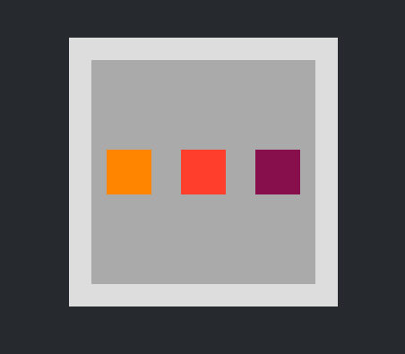

# DOM Picker

In animachine you can refer to DOM nodes with css selectors. The DOM Picker makes is easier to pick DOM nodes automatic css selector generator and graphic navigator for the DOM tree.

###[Try out here!](demo.animachine.org/#/Picker)

## Usage

### Picking

 - Click on any DOM Node
 - Click the plus (+) button in the middle of the DOM Picker
 It will create a new Track with a css selector for the picked DOM Node

### Navigating

 Use the arrow icons to navigate on the DOM tree.
 - Up - select parent
 - Down - select child
 - Left/Right - select siblings

### Tricks

 If the DOM node you click has a parent that already belongs to a Track, animachine will select that track. It's usually the expected behavior but if you to pick the first DOM node just hold command/ctrl down while you clicking.
