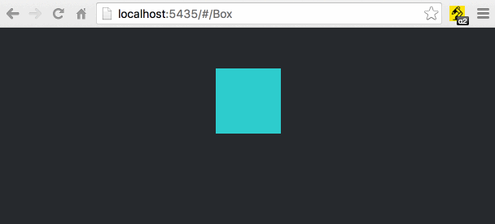
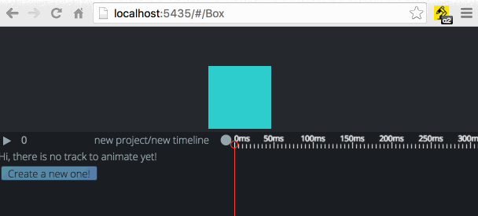
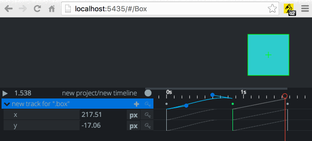

# quick go trough

### open the extension


Just click on the animachine icon in the top-left corner of the browser. If there is no project already loaded on the page it will set up an new empty one.

### pick DOM nodes


Click on anything in the browser window while animachine is open and the DOM Picker will show up over the DOM node. Click to the add button in the middle and it will set up a new Track with a css selector pointing to the picked DOM node.
> ######[DOM Picker](dom-picker.md)

### animate


When a Track is selected the transform handler will appear over its first belonging DOM node. Foe every transformation you make, animachine will create new Params and Keys at the given time. You can add, remove, and edit keys on the timeline just like in any other animation editor.

### ease
Click between two key on the timeline and a simple ease editor will appear to edit the ease.

### save


Open the menu (the circle button on the top of the timeline) and select save. You can download the source am.js or just copy to clipboard.
> ######[Save Project](save-project.md)


### reload
 - Include the saved am.js into your project (you can use it eather in the common js, amd, or global export way)
 - Apply it to some DOM nodes. Ie. ```myProject.myTimeline(domNode)```
 - Then reload the page and hit the animachine button. It will reload all the projects it finds in your app.
> ######[Load Project](load-project.md)
