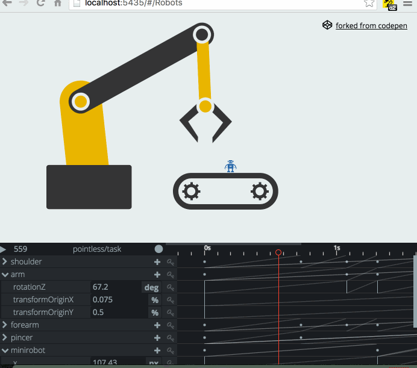

# Save Project

Click on the menu circle -> and save.
You can choose between downloading the .js file or copy its content to clipboard.

The saved file is always a simple .js which you can include into your app.

This .js contains:
  - your animations (as GSAP timelines defined with UMD)
  - the editor information (so you can continue)
  - all of its dependencies (except GSAP)

> **Note:** The last two should be optional and it will be so you can have smaller files for production*

> ###### [Load Project](load-project.md)
